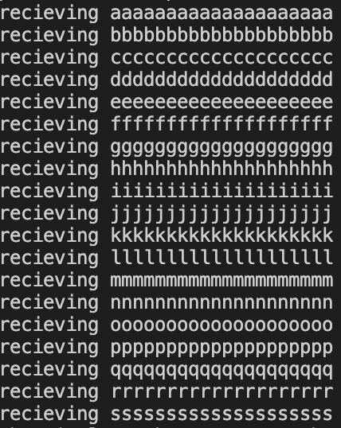
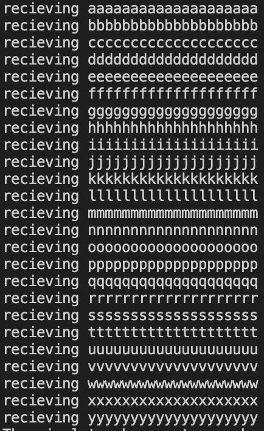

# CSCI4211_rdt_java
## Jeevan Prakash,Zhang CSCI4211,17/11/2021
## Java,A.java,B.java,simulator.class

### Compilation Section
#### Instructions for Compiling Stop and Wait
1. Ensure that you have the Java JDK
2. Go to to the stop_and_wait/src folder
3. Run `javac simulator.java`
#### Instructions for Compiling Go-Back-N
1. Ensure that you have the Java JDK
2. Go to to the go_back_n/src folder
2. Run `javac simulator.java`
3. Run `javac circular_buffer.java`

### Execution Section
#### Instructions for Executing Stop and Wait
1. Go to to the stop_and_wait/src folder
2. run `java simulator`
#### Instructions for Compiling Go-Back-N
1. Go to to the go_back_n/src folder
2. run `java simulator`

### Description Section
#### Stop and Wait
##### Description
> Stop and Wait protocol (in this case alternating bit protocol) sends data across the network from one side to the other and waits for an ack with the correct sequence nubmer before proceeding. A timer is set to ensure that if an ACK has not arrived for a while from the other side, the last packet will be resent to the other side. The sequence numbers in this implementation alternate between 0 and 1, hence the name alternating bit protocol. My A class waits for a payload from the 5th layer of the network in its `WAIT_LAYER5` state. Once A gets the payload, it will send it through the network with a sequence number of 0 or 1 depending on what the previous packet nubmer was, and it will update the state of A to `WAIT_ACK`. Class A will then store this packet that is just sent out, in case it needs to be resent to B. B will either receive the packet or it will get lost in the 3rd layer. If it is lost, a timeout will occur on the A side since no ACK will be received within `the estimated_rtt` of *30 seconds*. If a timeout occurs, the `lastpacket` is sent once again to the B class. If the B class receives the packet successfully it will send an ACK to A and send the payload to layer 5. If the ACK is lost in layer 3, a timeout will occur on A, and the packet will be sent once again to B. If the ACK is successfully received by A, A will update the state of A to `WAIT_LAYER5`, update the sequence number to 0 if the previous seq was 1 or vice versa, and reset the timer.
##### Added Data Structures/Fields
###### A class
- String state: String to store state of A (either `WAIT_ACK` or `WAIT_LAYER5`)
- int seq: int that stores the current sequence number that is being sent over to B
- int esimated_rtt: int that stores the estimated round trip time of a packet (30 seconds)
- packet lastpacket: packet object that represents the last packet that was sent
###### B class
- int seq: the next sequence number that is expected from A
##### Functions/Methods
###### A class
- initialization function of A: initialize the seq to 0, state to `WAIT_LAYER5`, and estimated_rtt to 30
- A_input(simulator sim, packet p):
    - @param sim is a simulator variable used for removing the timer, starting the timer, or sending data to the 3rd and 5th layers
    - @param p is an ACK packet that has been received from B
    - This method receives ACK packets from B
    - First, checksum is used to verify if the packet is uncorrupted
        - Return if not equal
    - Second, the acknum number is compared to the acknum of the last packet
        - Resend the packet in case of an incorrect acknum and restart the timer
        - In case of the correct acknum, remove the timer and change the state back to `WAIT_LAYER5`
    - no return value
- A_output(simulator sim, msg m):
    - @param sim is a simulator variable used for removing the timer, starting the timer, or sending data to the 3rd and 5th layers
    - @param m is a message payload that will be used to create a new packet to send
    - This method is called by the 5th layer
    - First, check to make sure that the state of A is not `WAIT_ACK` (A needs to be in `WAIT_LAYER5` state)
    - Second, construct a new packet
    - Third, restart the timer
    - Fourth, send the packet to B
    - Fifth, set the state to `WAIT_ACK` since A is now waiting for an ACK
    - no return value
- A_handle_timer(simulator sim):
    - @param sim is a simulator variable used for removing the timer, starting the timer, or sending data to the 3rd and 5th layers
    - This method handles the timeout events
    - First, restart the timer
    - Second, send the lastpacket to B again
    - Third, set the state to `WAIT_ACK`
    - no return value
###### B class
- initialization function of B: initialize the seq to 0
- B_input(simulator sim,packet pkt):
    - @param sim is a simulator variable used for removing the timer, starting the timer, or sending data to the 3rd and 5th layers
    - @param pkt is a packet variable which contains the payload to be sent to layer 5
    - This method receives the message payloads and sends ACK messages back
    - First, checksum is used to verify if the packet is uncorrupted
    - Second, if the packets sequence number does not match the B's current sequence number, an NACK is sent
    - Third, if the packets sequence number does match, the payload is sent to layer 5, an ACK is sent to A, and the next expected sequence number is flipped from 0 to 1 or vice versa
- Other methods are not required to be implemented
### Evaluation Section
#### Test Cases
1. Test Case 1
    - loss set to 0.2
    - corruption rate set to 0.2
    - Lambda set to 1000
    - nsimmax set to 20
    - This is the standard original simulation run with 0.2 packet loss probability and 0.2 corruption probability
    - All packets were sent correctly through this protocol through the use of the timeout functionality
    - The packet loss was handled by the timeout handler
    - The corruption was prevented through the checksum
    - All the logic has been explained in detail above

    
2. Test Case 2
    - loss set to 0
    - corruption rate set to 0
    - Lambda set to 1000
    - nsimmax set to 20
    - This is a standard run with no packet loss and corruption of packets
    - All the logic has been explained in detail above

    
3. Test Case 3
    - loss set to 0
    - corruption rate set to 0
    - Lambda set to 1000
    - nsimmax set to 26
    - This is a standard run with no packet loss and corruption of packets with more packets sent through
    - All the logic has been explained in detail above

    
4. Test Case 4
    - loss set to 0.5
    - corruption rate set to 0
    - Lambda set to 1000
    - nsimmax set to 26
    - This is much higher loss probability at 0.5 with no corruption probability
    - The packet loss was handled by the timeout handler
    - All the logic has been explained in detail above

    
5. Test Case 5
    - loss set to 0.5
    - corruption rate set to 0.6
    - Lambda set to 1000
    - nsimmax set to 26
    - All packets were sent correctly through this protocol through the use of the timeout functionality
    - The packet loss was handled by the timeout handler
    - The corruption was prevented through the checksum
    - All the logic has been explained in detail above

    
6. Test Case 6
    - loss set to 0
    - corruption rate set to 0.9
    - Lambda set to 100000
    - nsimmax set to 26
    - The corruption was prevented through the checksum
    - All the logic has been explained in detail above

    
7. Test Case 7
    - loss set to 0.9
    - corruption rate set to 0
    - Lambda set to 100000
    - nsimmax set to 26
    - All packets were sent correctly through this protocol through the use of the timeout functionality
    - The packet loss was handled by the timeout handler
    - All the logic has been explained in detail above

    
#### Go-Back-N
##### Description
> Go-Back-N protocol is a pipelining sending protocol where multiple packets can be sent through at time. Only a specified number of unacknowledged packets can exist in the network at once. On the receiver side I have a buffer which contains all the packets that have unacknowledged including the packets that have not been sent yet through the network. The receiver will only accept packets in order by keeping track of the next expected sequence number. Due to this behavior, the sender is able to perform cumulative acknowledgment. For example, if the sender has sent sequence number 0 to 8 and receives an ACK for a packet with ACK number 4, the sender can make the assumption that 0 through 4 packets have all been received successfully. This assumption can be made because the sender will only send ACKs in order. So that means if the receiver sent ACK number 4, it has also received the packets before 4. This protocol is more efficient than Stop-And-Wait protocol due to this efficiency. To emulate the buffer in my program, I use the circular_buffer class. I accept as many from layer 5 as there are spaces in the circular buffer. I will continue to send packets as long as there is space in the window. The window is referring to the sliding window protocol (another name for Go-Back-N protocol). If there is a timeout, my program will send all the packets that have been labeled as sent but have not been ACK'd yet. Whenever packets are ACK'd, I pop a specific number of packets off the buffer depending on the ACK number that I receive (referring to cumulative acknowledgment).
##### Added Data Structures/Fields
###### A class
- int seq: int that stores the current sequence number that is being sent over to B
- int esimated_rtt: int that stores the estimated round trip time of a packet (30 seconds)
- circular_buffer c_b: circular_buffer object that represents the buffer of unacknowledged packets that have either been sent through the network or are ready to be transmitted
- int window: int that contains the size of the window
- int nextAcknum: int that contains the next expected ACK number from B
- int packetsSent: int that contains the total number packets that are in the network
- boolean timerSet: boolean flag to keep track of whether the timer is set
###### B class
- int seq: the next sequence number that is expected from A
##### Functions/Methods
###### A class
- initialization function of A: initialize the seq to 0, estimated_rtt to 30, window size to 8, nextAcknum to 0, packetsSent to 0, timerSet to false, c_b to a new circular buffer of size 50
- A_input(simulator sim, packet p):
    - @param sim is a simulator variable used for removing the timer, starting the timer, or sending data to the 3rd and 5th layers
    - @param p is an ACK packet that has been received from B
    - This method receives ACK packets from B
    - First, checksum is used to verify if the packet is uncorrupted
        - Return if not equal
    - Second, the difference between the received acknum and the expected acknum is calculated
        - If the difference is less than 0, it means that a duplicate ACK has been received
            - Simply return in this case and let a timeout event take care of the NACK event
        - If that difference is 0, that means I received the expected acknum, so I will only pop one off the circular buffer
            - I will increment the acknum up by one
            - I will decrement the amount of packets in the network by one
        - If that difference is greater than 0, that means I received a later acknum, so I will perform cumulative acknowledgement
            - I use a for loop to pop multiple packets from the buffer
            - I will increment the acknum up by the number of packets popped off the buffer
            - I will decrement the amount of packets in the network by the number of packets popped off the buffer
    - Third, remove any timer that is running
    - no return value
- A_output(simulator sim, msg m):
    - @param sim is a simulator variable used for removing the timer, starting the timer, or sending data to the 3rd and 5th layers
    - @param m is a message payload that will be used to create a new packet to send
    - This method is called by the 5th layer
    - First, check to see if the buffer is full
        - If it is full, let the user know it is full and return
    - Second, construct a new packet
    - Third, increment the next sequence number to be used up by 1
    - Fourth, push packet onto circular buffer
    - Fifth, send packets over if there is space in the window
        - If there is space in the window, read all the packets that have not been unACK'd
        - Send packets that have not been sent yet up to the space left in the window
        - Reset and restart the timer after sending all those packets
    - no return value
- A_handle_timer(simulator sim):
    - @param sim is a simulator variable used for removing the timer, starting the timer, or sending data to the 3rd and 5th layers
    - This method handles the timeout events
    - First, read in all the unACK'd messages from the circular buffer
    - Second, decide how many packets to resend depending on the window size
    - Third, send all the packets
    - Fourth, start the timer
###### B class
- initialization function of B: initialize the seq to 0
- B_input(simulator sim,packet pkt):
    - @param sim is a simulator variable used for removing the timer, starting the timer, or sending data to the 3rd and 5th layers
    - @param pkt is a packet variable which contains the payload to be sent to layer 5
    - This method receives the message payloads and sends ACK messages back
    - First, checksum is used to verify if the packet is uncorrupted
    - Second, if the packets sequence number does match, the payload is sent to layer 5, an ACK is sent to A, and the next expected sequence number is incremented up by 1
    - Third, if the packets sequence number does not match the B's current sequence number, a NACK is sent
- Other methods are not required to be implemented
###### circular_buffer class
- Made a change to the read_all() function as there was an issue with the logic of the for loop
- I changed line 44 to `r = (r+1)%max` from `r = (r+1)%count`
### Evaluation Section
#### Test Cases
1. Test Case 1
    - loss set to 0.2
    - corruption rate set to 0.2
    - Lambda set to 1000
    - nsimmax set to 20
    - This is the standard original simulation run with 0.2 packet loss probability and 0.2 corruption probability
    - All packets were sent correctly through this protocol through the use of the timeout functionality
    - The packet loss was handled by the timeout handler
    - The corruption was prevented through the checksum
    - All the logic has been explained in detail above

    
2. Test Case 2
    - loss set to 0
    - corruption rate set to 0
    - Lambda set to 1000
    - nsimmax set to 20
    - This is a standard run with no packet loss and corruption of packets
    - All the logic has been explained in detail above

    
3. Test Case 3
    - loss set to 0
    - corruption rate set to 0
    - Lambda set to 1000
    - nsimmax set to 26
    - This is a standard run with no packet loss and corruption of packets with more packets sent through
    - All the logic has been explained in detail above

    
4. Test Case 4
    - loss set to 0.5
    - corruption rate set to 0
    - Lambda set to 10000
    - nsimmax set to 26
    - This is much higher loss probability at 0.5 with no corruption probability
    - The packet loss was handled by the timeout handler
    - All the logic has been explained in detail above

    
5. Test Case 5
    - loss set to 0.5
    - corruption rate set to 0.6
    - Lambda set to 100000
    - nsimmax set to 26
    - All packets were sent correctly through this protocol through the use of the timeout functionality
    - The packet loss was handled by the timeout handler
    - The corruption was prevented through the checksum
    - All the logic has been explained in detail above

    
6. Test Case 6
    - loss set to 0
    - corruption rate set to 0.9
    - Lambda set to 100000
    - nsimmax set to 26
    - The corruption was prevented through the checksum
    - All the logic has been explained in detail above

    
7. Test Case 7
    - loss set to 0.9
    - corruption rate set to 0
    - Lambda set to 100000
    - nsimmax set to 26
    - All packets were sent correctly through this protocol through the use of the timeout functionality
    - The packet loss was handled by the timeout handler
    - All the logic has been explained in detail above

    